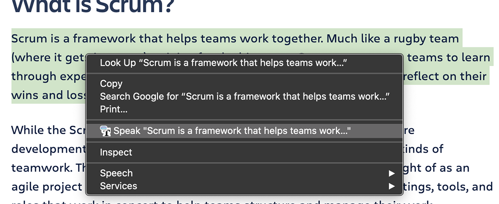
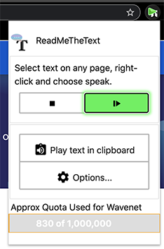

# ReadMeTheText BETA Extension
ReadMeTheText Extension uses Google's Beta text-to-speech API to read text from webpages and the clipboard.

It installs a right-click options to read selected text, or you can use the extension's toolbar menu to read text in your clipboard. This is handy when the page has taken over the right-click context menu.

>  
 
 Right-click context menu will read selected text on most pages

>  
>

The toolbar icon allows the sound to be paused and restarted (using the Play button)

For pages where the right-click conext menu is over-ridden (e.g. if the page uses the conext menu for features), 
then the text can be copied into the clipboard and the "Play text in clipboard" feature can be used.

Google has a quota when converting text to speech. It allows for 1 million characters per month
in the Free Tier, then charges a hefty $16 for the next 1 million characters.

Unfortunately, there's no API to check your usage quota (yet). So, the extension attempts to keep track of it for you.

### Motivations
I make a lot of typos when I compose emails and I never seem to notice them until _after_ I've sent them. 
Re-reading helps, but for whatever reason, I read what I expected I typed, not what's actually
there. This extension allows me to easily have any text read back to me in a pleasant voice!

Another common usage is reading an article or email in the background while I'm doing something else.

## Google Text-to-Speech is not free
Google's text-to-speech uses a lot of backend resources. While Google does give a generous Free Tier allotment

>  [Google's Pricing and Free-tier info](https://cloud.google.com/text-to-speech/pricing) - latest update on pricing and quotasgi

>  [Full list of voices](https://cloud.google.com/text-to-speech/docs/voices) if you want to hear what each sounds like

>  [Text-to-speech Speak-it demo](https://cloud.google.com/text-to-speech#section-2) Coding demo that allows you to try out different voice settings 

Text-to-speech Speak-it demo


### Finding in the Chrome Store

You can install it from here [url]


## Project layout

`packages.json` is only used to get the latest .ts (typescript) declaration files. These are used by modern IDEs to add basic type checking.

`/extension/` is the extensios

## Extension's Manifest Permissions

Extensions that need every possible permission are a security nightmare.This extension tries to increase privacy.

Obviously, the extension must have access to text to pass it to google for converting to speech. 
However, it does not have permission to all content on a page, just what you've selected.

It makes no other network calls other than to convert the text to speech api call. While settings are synced across machines,
that is handle by Chrome's syncing mechanism and the API Key is NOT stored anywhere but locally.

Reading the clipboard is disbabled by default and will prompt for permission when you go to use it.

For full transparency here are all the permissions in this extension and how they are used.

```json
"permissions": [
  "contextMenus", 
  "storage",
  "alarms"
],
  "optional_permissions": [
  "clipboardRead",
  "notifications",
],
```

|   Permission   | Usage                      |
|----------------|----------------------------|
|`contextMenus`  | Can ONLY access selected text on a page when right-click menu item is selected.|
|`   storage`    | Settings are saved and are synced across machines if Chrome is configured to do sync. Note: API key is NOT synced|
|   `alarms`     | This is an alternative to setTimeout that is background.js unload large buffers to be more memory friendly|
|`clipboardRead` | Used to text-to-speech the contents of the clipboard. Useful when page take over right-click menu|
|`notifications` | Used if the person wants to be warned when approaching quota limits (todo)

